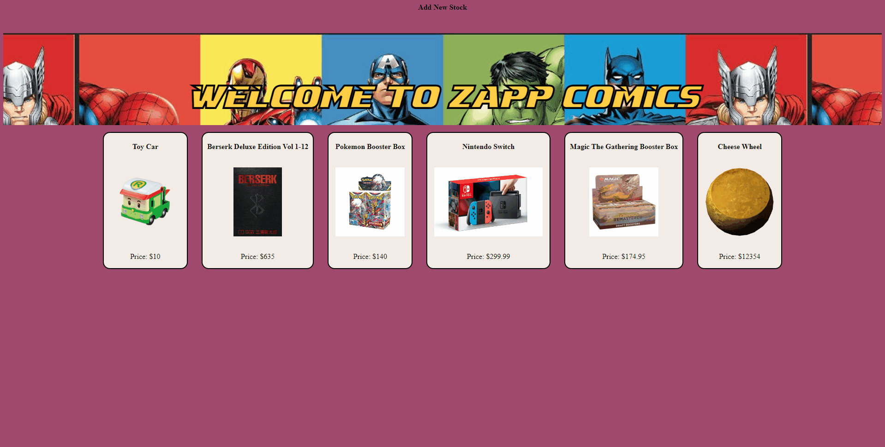

# Welcome to mod2_project 👋

> A small scale fullstack products page/web store to demonstrate the use of html/css/javaScript for frontend development and node.js/express.js/mongoDB for backend development. There are pages to display products from a database as a whole or a single item. In the single item page you can purchase/delete/update/search products on the frontend that will update the mongoDB database. There also is a page to add new items to the store and mongoDB as needed that will be displayed on the frontend.

## Author

👤 **Albruce Appesh**

* Github: [@apex-89](https://github.com/apex-89)
* LinkedIn: [@appesh89](https://linkedin.com/in/appesh89)

## DEMO

## Project Details

###Pages:
HOME page (index):

- Shows list of products (can visit each product from here)
- all the products are displayed
- the images link to the PRODUCT page
- a link to add a new product.

PRODUCT page:

- Shows specific product and it's details
- a link back to the HOME page
- a link to edit the product (goes to the edit page)
- a delete button that deletes
- user can also search for a specific product from this page
- Clicking buy button lowering remaining by 1 when quantity is zero "OUT OF STOCK" is displayed and button greys out.

EDIT page:

- allow you to edit the data of a specific product (using it’s product ID)

CREATE page:

- allows for creation of new products (users will include a URL for the image)

###Redirects:

1. The create route should redirect to HOME after creation
2. The delete route should redirect to HOME after deletion
3. The edit route will redirect to the edited product's PRODUCT page after the object is changed in your collection.

###Routes

1. /get_products - responds with all products in your collection
2. /get_specific_product/:product_id - responds with one specific product from your collection
3. /create_product - uses information from req.body to make a new product in your collection
4. /delete_product/ - The product ID should be included in the URL as a query. Example: /delete_product/?productId=63cd55e8b260470b1c1f2cc0
5. /update_product - uses information from req.body to update the specific product

##Tech Stack

- JavaScript
- MongoDB
- Express.js
- Node.js

## Show your support

Give a ⭐️ if this project helped you!

***
_This README was generated with ❤️ by [readme-md-generator](https://github.com/kefranabg/readme-md-generator)_